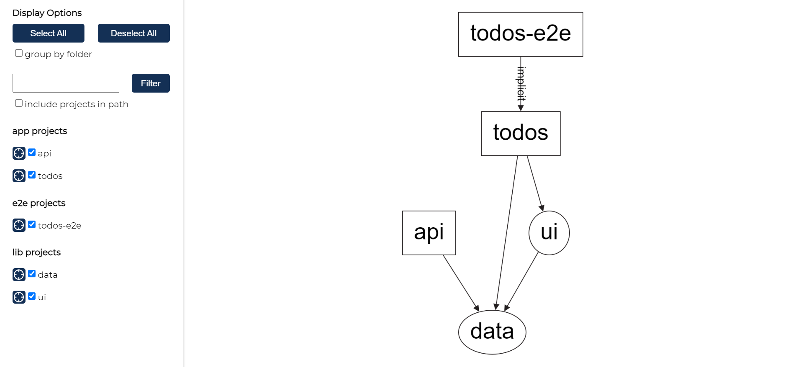

# :zap: Nx Angular App

* Angular app to show list of todos stored in a backend
* Tutorial code from [Nx](https://nx.dev/latest/angular/tutorial/01-create-application)
* **Note:** to open web links in a new window use: _ctrl+click on link_


## :page_facing_up: Table of contents

* [:zap: Nx Angular App](#zap-nx-angular-app)
  * [:page_facing_up: Table of contents](#page_facing_up-table-of-contents)
  * [:books: General Info](#books-general-info)
  * [:camera: Screenshots](#camera-screenshots)
  * [:signal_strength: Technologies](#signal_strength-technologies)
  * [:floppy_disk: Setup](#floppy_disk-setup)
  * [:computer: Code Examples](#computer-code-examples)
  * [:clipboard: Status & To-Do List](#clipboard-status--to-do-list)
  * [:clap: Inspiration](#clap-inspiration)
  * [:file_folder: License](#file_folder-license)
  * [:envelope: Contact](#envelope-contact)

## :books: General info

* Nx uses a single repo for both frontend and backend apps with a shared library.
* Nx ensures that adding another app to the repo does not increase existing test or build times.
* Uses computational caching - so test and lint tasks are not repeated on unchanged code.
* Nx can create a dependency diagram - see screenshot below.

## :camera: Screenshots



## :signal_strength: Technologies

* [Nx with Angular plugin](https://nx.dev/angular) used to create project workspace
* [Angular framework v12](https://angular.io/)
* [Nest Plugin v7](https://nx.dev/latest/angular/nest/overview)

## :floppy_disk: Setup

* Install nx using `npm install -g nx`
* In app, install dependencies using `npm i`
* `nx dep-graph` to see a diagram of the dependencies of your projects.
* `nx serve todos` for a dev server. Frontend will open at `http://localhost:4200/` - refreshes on code changes
* `npx nx build todos`
* `npx nx lint todos --with-deps` to lint todos app & libraries

**Nest Backend:**

* `npx nx serve api` to serve the backend
* `npx nx build api` to build the backend
* `npx nx test api` to test the backend

## :wrench: Testing

* `npx nx e2e todos-e2e --watch` for end to end testing of todos app
* `npx nx test` to test todos app - tests need fixing

## :computer: Code Examples

* From `app.service.ts`: a simple function to create a random todo title string

```typescript
addTodo() {
    this.todos.push({
      title: `New todo ${Math.floor(Math.random() * 1000)}`,
    });
  }
```

## :cool: Features

* tba

## :clipboard: Status, To-Do List

* Status: Working.
* To-Do: `nxapp\apps\todos\src\app\app.component.spec.ts` test specs need to be updated.

## :clap: Inspiration/General Tools

* [Angular Nx Tutorial - Step 1: Create Application](https://nx.dev/latest/angular/tutorial/01-create-application)

## :file_folder: License

* This project is licensed under the terms of the MIT license.

## :envelope: Contact

* Repo created by [ABateman](https://github.com/AndrewJBateman), email: gomezbateman@yahoo.com
